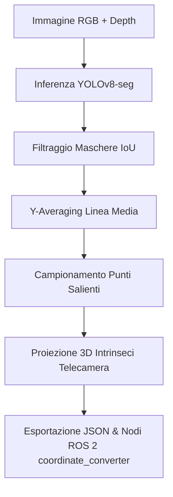

# Integrazione di una Rete Neurale Artificiale e Controllo Robotico per il Taglio Automatico di Indumenti

<p align="center">
  
</p>

Pipeline completa di visione artificiale e percezione 3D per l'identificazione, segmentazione e localizzazione spaziale delle parti salienti di capi d'abbigliamento flessibili (maglioncini: **colletto**, **polsini** e **bordo inferiore / fondomaglia**).

Il sistema integra **YOLOv8-seg Nano** per la segmentazione ad istanze in tempo reale, post-processing geometrico avanzato basato su *Y-averaging*, e fusione di dati **RGB-D** (da sensore **Intel RealSense D435i** o da simulatore **Unity**) per estrarre le coordinate tridimensionali $(X, Y, Z)$ calibrate per la manipolazione tramite braccio robotico (es. *Universal Robots UR5*).

Include inoltre l'integrazione completa con **ROS 2** (package `coordinate_converter`) per pianificare ed eseguire le traiettorie di manipolazione sia all'interno del simulatore Unity che sul manipolatore industriale UR5 reale.

---

## 📌 Indice
1. [Funzionalità e Architettura](#-funzionalità-e-architettura)
2. [Struttura del Repository](#-struttura-del-repository)
3. [Requisiti e Installazione Modulo Visione](#-requisiti-e-installazione-modulo-visione)
4. [Guida all'Uso della Visione](#-guida-alluso-della-visione)
   - [1. Acquisizione Dati con RealSense](#1-acquisizione-dati-con-realsense-d435i)
   - [2. Preparazione Dataset e Addestramento](#2-preparazione-dataset-e-addestramento)
   - [3. Test Rapido su Singola Immagine](#3-test-rapido-su-singola-immagine)
   - [4. Inferenza Completa ed Estrazione Coordinate](#4-inferenza-completa-ed-estrazione-coordinate-2d3d)
   - [5. Verifica 3D con Point Cloud e Profondità](#5-verifica-3d-con-point-cloud-e-profondità)
   - [6. Inferenza con Dati Sintetici da Simulazione Unity](#6-inferenza-con-dati-sintetici-da-simulazione-unity)
5. [Algoritmo Geometrico di Estrazione 3D](#-algoritmo-geometrico-di-estrazione-3d)
6. [Formato dei Dati in Uscita](#-formato-dei-dati-in-uscita)
7. [Valutazione delle Prestazioni](#-valutazione-delle-prestazioni)
8. [Integrazione ROS 2 (`coordinate_converter`) per Unity e UR5 Reale](#-integrazione-ros-2-coordinate_converter-per-unity-e-ur5-reale)
   - [A cosa servono i moduli ROS](#a-cosa-servono-i-moduli-ros)
   - [Creazione del Package e Configurazione (Obbligatoria)](#creazione-del-package-e-configurazione-obbligatoria)
   - [Utilizzo con la Simulazione Unity (ROS-TCP-Endpoint)](#utilizzo-con-la-simulazione-unity-ros-tcp-endpoint)
   - [Utilizzo con il Manipolatore UR5 Reale](#utilizzo-con-il-manipolatore-ur5-reale)
9. [Autori e Riferimenti](#-autori-e-riferimenti)

---

## 🧠 Funzionalità e Architettura

Il sistema è progettato per operare su piattaforme embedded ad alta efficienza computazionale (come **NVIDIA Jetson Orin Nano**) con vincoli di tempo reale.

### Punti Chiave del Modello
* **Modello Base:** [YOLOv8n-seg](https://docs.ultralytics.com/tasks/segment/) (Ultralytics), ottimizzato per la segmentazione real-time.
* **Classi Rilevate:**
  * `0: Collar` — Linea del colletto.
  * `1: Hem` — Bordo inferiore (fondomaglia).
  * `2: Cuff` — Polsini delle maniche (distinzione automatica sinistro/destro).
* **Backbone & Neck:** Versione modificata di CSPDarknet con PANet (Path Aggregation Network) per estrazione multi-scala delle feature.
* **Filtri di Profondità:** Mappe RGB-D acquisite con filtraggio hardware/software RealSense (filtro spaziale, temporale, hole filling ed eliminazione automatica del piano di appoggio/outliers).
* **Supporto Ambienti Reali e Virtuali:** Supporta input sia da telecamere fisiche RealSense che da stream sintetici generati nel simulatore Unity (RGB + buffer binari float32).

---

## 📂 Struttura del Repository

La codebase è organizzata in moduli dedicati alla pipeline di visione, train/test, integrazione robotica ROS 2 e dati:

```text
Cloth-Segmentation-Pipeline/
├── acquisizione.py                     # Script di cattura RGB-D con Intel RealSense D435i
├── data.yaml                           # Configurazione del dataset YOLO (classi e split)
├── requirements.txt                    # Dipendenze Python
├── yolov8n-seg.pt                      # Pesi pre-addestrati Nano di partenza
│
├── codice train-test/                  # Script principali di addestramento, inferenza e verifica
│   ├── info.txt                        # Guida rapida ai file e agli output
│   ├── geometry_utils.py               # Utilità geometriche e visualizzazione Open3D
│   ├── yolo_train.py                   # Addestramento YOLO ed esportazione ONNX
│   ├── test_yolo_single.py             # Test rapido di segmentazione su una singola immagine
│   ├── yolo_inference.py               # Classe SweaterDetector ed estrazione coordinate 2D/3D
│   ├── verify_depth_extraction.py      # Validazione coordinate 3D su nuvola di punti
│   ├── verifica_depth.py               # Ispezione diretta point cloud RealSense
│   └── test_unity_inference.py         # Test con telecamera virtuale e profondità Unity
│
├── risultati rete/                     # Destinazione automatica degli output di inferenza
│   ├── inference_result.jpg            # Immagine con segmentazione plottata (test_yolo_single)
│   ├── yolo_inference_result.jpg       # Risultato inferenza 2D con linee e punti campionati
│   ├── inference_result_depth.jpg      # Risultato inferenza RGB-D con depth applicata
│   ├── yolo_inference_unity_result.jpg # Risultato inferenza su immagini Unity
│   ├── robot_coordinates.json          # Coordinate 2D estratte in formato JSON
│   ├── robot_coordinates_3d.json       # Coordinate 3D (X, Y, Z in metri/mm)
│   └── robot_coordinates_unity.json    # Coordinate 3D estratte dalla simulazione Unity
│
├── risultati train-val/                # Metriche, curve e pesi dell'addestramento
│   └── yolo_run/
│       ├── weights/                    # best.pt, best.onnx, last.pt
│       ├── confusion_matrix.png        # Matrice di confusione
│       ├── results.png                 # Curve di loss e mAP per epoca
│       └── BoxF1_curve.png, MaskF1...  # Curve di precisione, recall e F1
│
├── ros/                                # Nodi ROS 2 per simulazione Unity e manipolatore UR5
│   ├── setup.py                        # Entry points e configurazione del package coordinate_converter
│   ├── unity/                          # Script ROS 2 per simulazione in Unity (topic /joint_targets)
│   │   ├── home_joint_trajectory.py    # Movimento a configurazioni home/up con feedback in closed-loop
│   │   └── spline_separata.py          # Controllo cinematico DLS e spline sui punti del maglioncino
│   └── ur5/                            # Script ROS 2 per robot UR5 reale (Action FollowJointTrajectory)
│       ├── home_joint_final.py         # Movimento a pose sicure/home/camera con profili trapezoidali
│       └── spline_separata_finale.py   # Controllo cinematico DLS e invio spline al controllore UR5 reale
│
└── dataset_rgbd_maglioncino/           # Dataset RGB-D reale acquisito da RealSense D435i
```

---

## 💻 Requisiti e Installazione Modulo Visione

### 1. Prerequisiti di Sistema
* **Sistema Operativo:** Windows 10/11, Ubuntu 20.04/22.04 LTS o NVIDIA JetPack (Jetson).
* **Python:** versione `3.8` o superiore (consigliato Python `3.10`).
* **GPU (Consigliata):** Scheda grafica NVIDIA con supporto CUDA (per addestramento e inferenza rapida), oppure esecuzione su CPU.

### 2. Clonazione del Repository
```bash
git clone https://github.com/EttoreRii/Cloth-Segmentation-Pipeline.git
cd Cloth-Segmentation-Pipeline
```

### 3. Creazione dell'Ambiente Virtuale
È consigliato creare un ambiente virtuale isolato per evitare conflitti tra dipendenze:

**Su Windows (PowerShell):**
```powershell
python -m venv venv
.\venv\Scripts\Activate.ps1
```

**Su Linux / macOS:**
```bash
python3 -m venv venv
source venv/bin/activate
```

### 4. Installazione delle Dipendenze
Installa i pacchetti necessari tramite `pip`:

```bash
pip install --upgrade pip
pip install -r requirements.txt
```

> [!NOTE]
> Se desideri sfruttare l'accelerazione CUDA con PyTorch, installa la build con supporto CUDA dal sito ufficiale di [PyTorch](https://pytorch.org/get-started/locally/) prima o dopo `requirements.txt`:
> ```bash
> pip install torch torchvision --index-url https://download.pytorch.org/whl/cu118
> ```

---

## 🚀 Guida all'Uso della Visione

Tutti gli script all'interno della cartella `codice train-test/` sono configurati per risolvere automaticamente i percorsi rispetto alla cartella principale del repository. È possibile eseguirli sia dalla root del progetto che dall'interno della cartella `codice train-test/`.

### 1. Acquisizione Dati con RealSense D435i
Per acquisire nuove coppie di immagini RGB e mappe di profondità sincronizzate e filtrate:
1. Connetti la telecamera **Intel RealSense D435i** tramite cavo USB 3.0.
2. Esegui:
   ```bash
   python acquisizione.py
   ```
3. Lo script applica filtri spaziali, temporali e di riempimento buchi (*hole-filling*), calcola la mediana su 15 frame per eliminare il rumore e salva i file in `dataset_rgbd_maglioncino/<timestamp>_rgb.png` e `<timestamp>_depth.png`.

---

### 2. Preparazione Dataset e Addestramento

Se hai etichettato nuove immagini con CVAT (in formato polilinee/poligoni XML):
1. Converti le annotazioni nel formato compatibile con YOLOv8-seg:

2. Suddividi i campioni in set di Training (80%) e Validation (20%):

3. Avvia l'addestramento della rete YOLOv8n-seg:
   ```bash
   python "codice train-test/yolo_train.py"
   ```
   * I pesi addestrati e le metriche di validazione verranno salvati in `risultati train-val/yolo_run/weights/best.pt`.
   * Al termine del training, il modello viene automaticamente esportato in formato ONNX (`best.onnx`) per massima portabilità.

---

### 3. Test Rapido su Singola Immagine
Per testare la segmentazione su una singola immagine e visualizzare le maschere rilevate:

```bash
# Esecuzione standard con parametri di default
python "codice train-test/test_yolo_single.py"

# Esecuzione specificando un'immagine custom e soglia di confidenza
python "codice train-test/test_yolo_single.py" --image "dataset_rgbd_maglioncino/20260109_153431_498491_rgb.png" --conf 0.3
```
* **Output salvato:** `risultati rete/inference_result.jpg`.

---

### 4. Inferenza Completa ed Estrazione Coordinate (2D/3D)
Per eseguire la pipeline di post-processing geometrico con estrazione dei punti di grasping per il robot:

```bash
python "codice train-test/yolo_inference.py"
```
* **Cosa fa:**
  * Esegue la segmentazione di colletto, polsini e fondomaglia.
  * Filtra maschere sovrapposte tramite IoU.
  * Calcola lo scheletro della cucitura (*Y-averaging*) ed estrae i punti campionati.
  * Salva la visualizzazione grafica con punti e linee in `risultati rete/yolo_inference_result.jpg`.
  * Serializza le coordinate estratte in `risultati rete/robot_coordinates.json`.

---

### 5. Verifica 3D con Point Cloud e Profondità
Per combinare le immagini a colori con la mappa di profondità reale, convertire i punti in coordinate metriche $(X, Y, Z)$ e aprire una finestra interattiva 3D con Open3D:

```bash
python "codice train-test/verify_depth_extraction.py"
```
* **Cosa fa:**
  * Associa a ciascun punto 2D la profondità reale della RealSense filtrando gli outlier del piano di lavoro.
  * Calcola le coordinate 3D tramite i parametri intrinseci della telecamera.
  * Genera e visualizza la point cloud 3D con sfere colorate posizionate sui punti di presa:
    * 🟡 **Giallo:** Colletto (*Collar*)
    * 🟢 **Verde:** Polsini (*Cuff*)
    * 🟣 **Magenta:** Bordo inferiore (*Hem*)
  * Stampa a console le matrici già formattate in formato NumPy, pronte per essere incollate nel controllore del robot.
  * Salva i risultati in `risultati rete/robot_coordinates_3d.json` e `risultati rete/inference_result_depth.jpg`.

Per ispezionare esclusivamente la point cloud RGB-D grezza acquisita:
```bash
python "codice train-test/verifica_depth.py"
```
---

### 6. Inferenza con Dati Sintetici da Simulazione Unity
Per validare il sistema in ambiente simulato (es. Unity) con telecamera virtuale zenitale:

```bash
python "codice train-test/test_unity_inference.py"
```
* **Cosa fa:**
  * Carica la texture RGB e il buffer float32 di profondità (`.bin`) generato dal simulatore.
  * Applica gli intrinseci della telecamera virtuale Unity (FOV 60° verticale).
  * Salva l'immagine risultante in `risultati rete/yolo_inference_unity_result.jpg` e le coordinate in `risultati rete/robot_coordinates_unity.json`.

---
## 📐 Algoritmo Geometrico di Estrazione 3D

Una volta ottenute le maschere binarie delle istanze rilevate da YOLOv8-seg, la pipeline esegue un raffinamento geometrico in 4 fasi:



1. **Filtraggio Maschere (IoU Non-Maximum Suppression):** Se compaiono istanze multiple o frammentate per la stessa classe, viene mantenuta quella a confidenza maggiore eliminando le sovrapposizioni spurie.
2. **Y-Averaging (Estrazione Scheletro Medio):** Per ogni coordinata $x$ appartenente alla maschera, viene calcolato il valor medio delle ordinate $y$:
   $$\bar{y}(x) = \frac{1}{N_x} \sum_{i=1}^{N_x} y_i$$
   Questo permette di isolare la linea centrale della cucitura eliminando le variazioni dovute allo spessore del tessuto o a pieghe superficiali.
3. **Campionamento Geometrico Adattivo:**
   * **Collar & Hem:** Vengono estratti $N$ punti equidistanti per approssimare fedelmente la curvatura.
   * **Cuff:** Vengono estratti il punto iniziale e finale di ciascun polsino, ordinati lungo l'asse $X$ per separare automaticamente il polsino sinistro (`polsino_sx`) da quello destro (`polsino_dx`).
4. **Proiezione Pinhole 3D:** Conoscendo la matrice degli intrinseci della telecamera ($f_x, f_y, c_x, c_y$) e il valore di profondità $Z$ (espresso in metri), ciascun punto $(x_{pix}, y_{pix})$ viene retroproiettato nello spazio tridimensionale:
   $$X = \frac{(x_{pix} - c_x) \cdot Z}{f_x}, \quad Y = \frac{(y_{pix} - c_y) \cdot Z}{f_y}$$

---

## 💾 Formato dei Dati in Uscita

Le coordinate 3D finali vengono salvate in file **JSON** all'interno della cartella `risultati rete/`.

Esempio di struttura generata da `robot_coordinates_3d.json`:

```json
{
    "Cuff": [
        {
            "start": [-0.158, 0.082, 0.725],
            "end": [-0.121, 0.086, 0.724]
        },
        {
            "start": [0.124, 0.085, 0.723],
            "end": [0.162, 0.081, 0.724]
        }
    ],
    "Hem": [
        {
            "points": [
                [-0.095, -0.152, 0.730],
                [-0.047, -0.150, 0.731],
                [0.002, -0.149, 0.730],
                [0.051, -0.151, 0.729],
                [0.098, -0.153, 0.730]
            ]
        }
    ],
    "Collar": [
        {
            "left": [-0.042, 0.141, 0.720],
            "right": [0.043, 0.140, 0.721],
            "curve_points": [
                [-0.042, 0.141, 0.720],
                [-0.021, 0.115, 0.721],
                [0.001, 0.108, 0.722],
                [0.022, 0.116, 0.721],
                [0.043, 0.140, 0.721]
            ]
        }
    ]
}
```

Inoltre, gli script stampano direttamente a terminale la definizione NumPy pronta per essere inclusa nel pianificatore di moto del braccio manipolatore nei nodi `coordinate_converter`:

```python
# Polsino sinistro e destro interpolati
polsino_sx_raw = self.rete_to_base(np.array([[-0.158, 0.082, 0.725], [-0.121, 0.086, 0.724]]))
self.polsino_sx_fitto = self.prendi_punti_intermedi(polsino_sx_raw[0], polsino_sx_raw[1])

# Fondo maglia
self.fondo_maglia = self.rete_to_base(np.array([...]))

# Colletto
self.colletto = self.rete_to_base(np.array([...]))
```

---

## 📊 Valutazione delle Prestazioni

Il modello è stato valutato sul validation set al termine delle 30 epoche di training:

| Metrica | Precision | Recall | mAP@50 |
| :--- | :---: | :---: | :---: |
| **Box (Detection)** | 85.4% | 85.0% | **90.3%** |
| **Mask (Segmentation)** | 65.4% | 60.7% | **56.8%** |

### Analisi dei Risultati
* **Localizzazione Robusta:** L'elevato valore di **mAP@50 per i box (90.3%)** assicura un rilevamento affidabile delle parti anche in presenza di rotazioni o deformazioni del capo.
* **Segmentazione Ottimale per il Grasping:** Sebbene la complessità dei tessuti morbidi porti a un mAP@50 delle maschere del 56.8%, l'algoritmo di **Y-averaging** estrae fedelmente la mezzeria e compensa eventuali imperfezioni sui bordi del tessuto, fornendo traiettorie di grasping stabili e ripetibili per il robot.
---

## 🤖 Integrazione ROS 2 (`coordinate_converter`) per Unity e UR5 Reale

La cartella `ros/` contiene i nodi di controllo cinematico e di traiettoria sviluppati in **ROS 2** per connettere la percezione visiva alla manipolazione robotica. Permette di guidare sia il robot simulato in **Unity** sia il manipolatore **Universal Robots UR5 fisico**.

### A cosa servono i moduli ROS

1. **Simulazione in Unity (`ros/unity/`):**
   * **`home_joint_trajectory.py`:** Pianificatore a feedback ad anello chiuso (*closed-loop*). Riceve lo stato da `/joint_states`, calcola il profilo di velocità ed invia i comandi al topic `/joint_targets` per portare il robot in posizioni sicure/predefinite (`home`, `up`).
   * **`spline_separata.py`:** Controllore cinematico completo. Utilizza la cinematica diretta, lo Jacobiano geometrico con inversione a minimi quadrati smorzati (**DLS - Damped Least Squares**) e genera traiettorie a spline cartesiane attraverso i punti salienti del capo (7 fasi di movimento trapezie per stendere/manipolare il maglioncino).

2. **Robot Reale UR5 (`ros/ur5/`):**
   * **`home_joint_final.py`:** Si interfaccia al driver ufficiale dell'UR5 tramite l'Action ROS 2 `/scaled_joint_trajectory_controller/follow_joint_trajectory`. Muove il robot fisico tra configurazioni note (`home`, `up`, `camera`, `ortogonale`, `finale`) con profili di accelerazione trapezoidali.
   * **`spline_separata_finale.py`:** Controllore cinematico per l'UR5 reale. Calcola l'inversa cinematica, gestisce l'orientamento dell'end-effector lungo le spline generate dalle coordinate del capo ed invia i comandi di traiettoria all'Action Server hardware.

---

### Creazione del Package e Configurazione (Obbligatoria)

> [!IMPORTANT]
> Per eseguire i nodi ROS 2, è necessario creare un apposito package in un workspace ROS 2. 
> Il package **DEVE chiamarsi esattamente `coordinate_converter`** e deve essere creato con build-type **`typepython`** (`ament_python`). Inoltre, il file `setup.py` generato **DEVE essere sostituito con quello fornito nella cartella `ros/` del repository**.

Seguire questi passaggi per configurare l'ambiente ROS 2:

#### 1. Creare o aprire un Workspace ROS 2
```bash
mkdir -p ~/ros2_ws/src
cd ~/ros2_ws/src
```

#### 2. Creare il package `coordinate_converter` (Python)
```bash
ros2 pkg create --build-type ament_python coordinate_converter
```

#### 3. Sostituire il file `setup.py`
Sostituisci il file `setup.py` generato con quello contenuto nella cartella `ros/` di questo repository:
```bash
# Esempio copiando dal repository locale:
cp /percorso/a/Cloth-Segmentation-Pipeline/ros/setup.py ~/ros2_ws/src/coordinate_converter/setup.py
```

#### 4. Copiare gli script Python nel package
Copia gli script da eseguire nella cartella dei sorgenti del package (`~/ros2_ws/src/coordinate_converter/coordinate_converter/`):

* **Se utilizzi la simulazione Unity:**
  ```bash
  cp /percorso/a/Cloth-Segmentation-Pipeline/ros/unity/home_joint_trajectory.py ~/ros2_ws/src/coordinate_converter/coordinate_converter/
  cp /percorso/a/Cloth-Segmentation-Pipeline/ros/unity/spline_separata.py ~/ros2_ws/src/coordinate_converter/coordinate_converter/
  ```

* **Se utilizzi il robot reale UR5:**
  ```bash
  cp /percorso/a/Cloth-Segmentation-Pipeline/ros/ur5/home_joint_final.py ~/ros2_ws/src/coordinate_converter/coordinate_converter/
  cp /percorso/a/Cloth-Segmentation-Pipeline/ros/ur5/spline_separata_finale.py ~/ros2_ws/src/coordinate_converter/coordinate_converter/
  ```

*(È possibile copiare tutti e quattro gli script per supportare indifferentemente entrambi gli ambienti).*

#### 5. Compilare il package
```bash
cd ~/ros2_ws
colcon build --packages-select coordinate_converter
source install/setup.bash
```

---

### Utilizzo con la Simulazione Unity (ROS-TCP-Endpoint)

> [!WARNING]
> Prima di lanciare qualsiasi nodo per Unity, **è indispensabile aprire il bridge ROS-TCP-Endpoint** per consentire lo scambio di messaggi di rete tra l'applicazione Unity e i nodi ROS 2.

1. **Avviare il server ROS-TCP-Endpoint:**
   ```bash
   ros2 run ros_tcp_endpoint default_server_endpoint --ros-args -p ROS_IP:=0.0.0.0
   ```

2. **Avviare la scena Unity** premendo *Play* (verificare che l'indicatore di connessione al bridge ROS sia verde/connesso).

3. **Portare il robot in posizione Home:**
   In un nuovo terminale (con il workspace configurato tramite `source install/setup.bash`):
   ```bash
   ros2 run coordinate_converter home_joint_trajectory
   ```

4. **Avviare il controllo e la manipolazione su spline:**
   ```bash
   ros2 run coordinate_converter spline_separata
   ```
   Il robot eseguirà le spline cartesiane calcolate sulla base dei punti rilevati del maglioncino.

---

### Utilizzo con il Manipolatore UR5 Reale

1. **Avviare il driver del robot UR5:**
   Assicurati che il driver ROS 2 (`ur_robot_driver`) sia in esecuzione e connesso all'indirizzo IP del robot:
   ```bash
   ros2 launch ur_robot_driver ur5.launch.py robot_ip:=<ROBOT_IP> launch_rviz:=true
   ```

2. **Posizionare il robot in una configurazione sicura o in posa camera:**
   ```bash
   # Muove il robot alla configurazione 'home' di default
   ros2 run coordinate_converter home_joint_final

   # Oppure specificare una configurazione predefinita (es. 'camera', 'ortogonale', 'up', 'finale'):
   ros2 run coordinate_converter home_joint_final camera
   ```

3. **Eseguire la traiettoria di manipolazione sul capo reale:**
   ```bash
   ros2 run coordinate_converter spline_separata_finale
   ```
   Il controllore calcolerà la cinematica inversa DLS in tempo reale inviando i waypoint interpolati allo `scaled_joint_trajectory_controller`.

---

## 👥 Autori e Riferimenti
* Corso di **Dynamics and Control of intelligent robots and vehicles**
* Sviluppato da Eremita Gianluca e Ricci Ettore